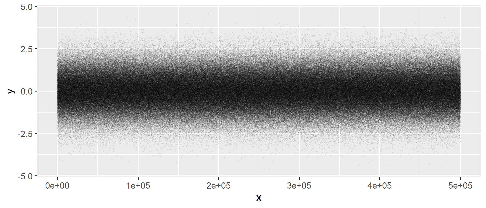
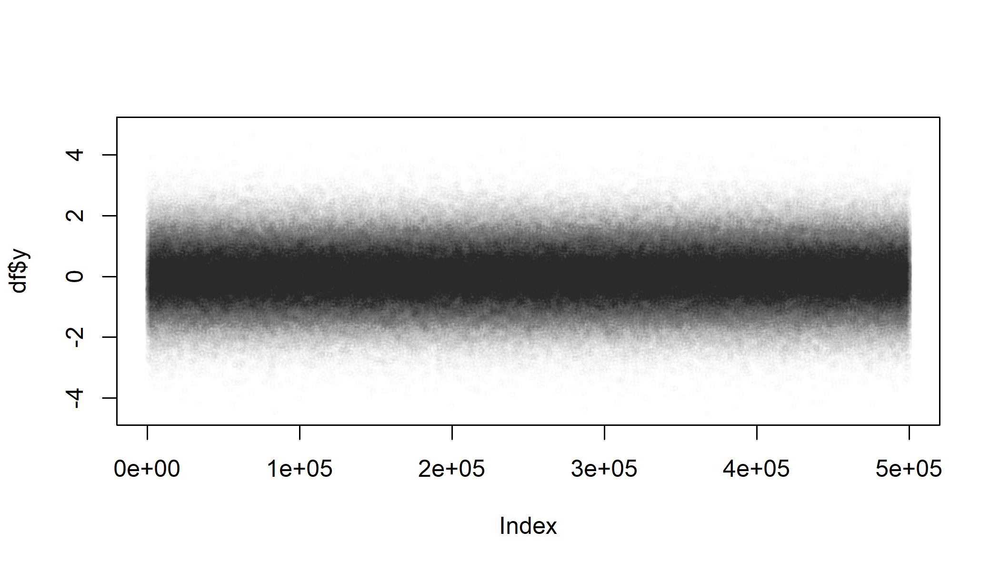

Plotting a lot of data can be awfully slow. Let's render plots in a `job` so that we kan keep working in the meantime. To demonstrate, here's a simple dataset with 500k rows which takes 10+ seconds to render:

```{r}
n = 5e5
df = data.frame(x = seq_len(n), y = rnorm(n))
```

## Render a `ggplot2`
`ggplot2` is fast at building the plot "grammar" but rendering can be slow. So let's build the plot in our main session but offload the rendering to a `job::job()`. We need to render it to a file because the job has no viewer.

```{r, eval = FALSE}
# Build plot
library(ggplot2)
gg = ggplot(df, aes(x = x, y = y)) + 
  geom_point(size = 0.1, alpha = 0.05)

# Render as a job
job::job({
  ggsave("gg_points.png", plot = gg, width = 7, height = 3)
})
```



## Render a base plot
We can do the same for base plots:

```{r, eval = FALSE}
job::job({
  png(filename = "base_points.png", width = 7, height = 4, units = "in", res = 300)
  plot(df$y, cex = 0.5, col = rgb(0, 0, 0, alpha = 0.01))
  dev.off()
})
```


